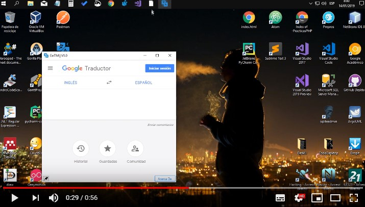
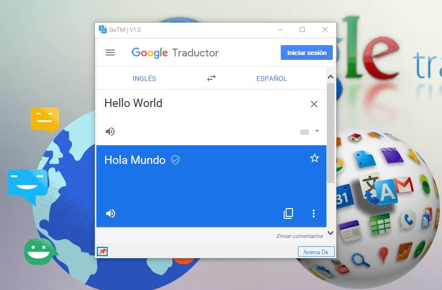
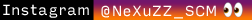
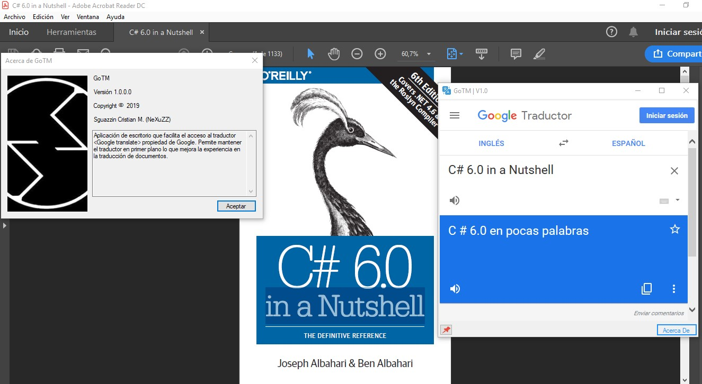
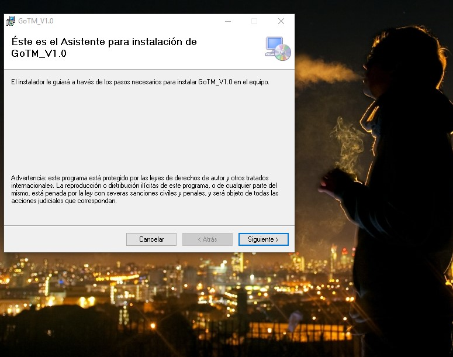
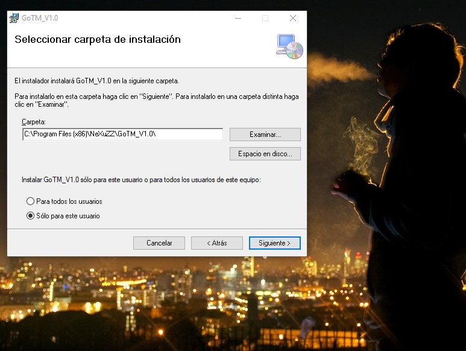
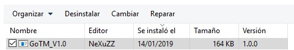
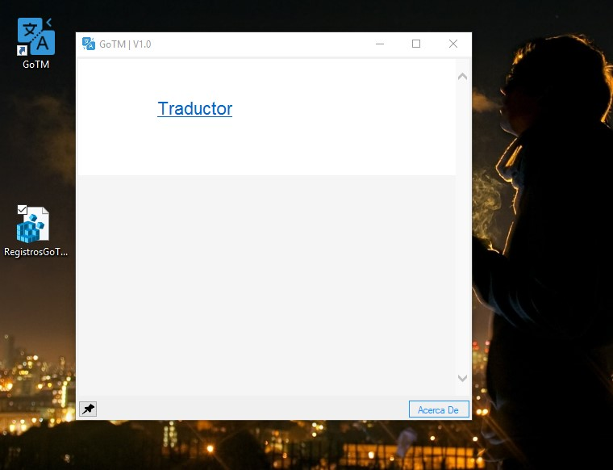
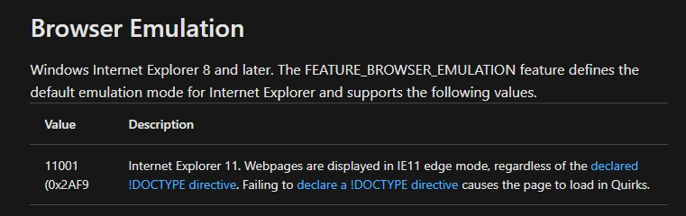

README.md
14 de enero de 2019 9:16
# GoTM | Google Translate Desktop

Aplicación simple que facilita el uso de Google Translate :satisfied:, la idea es simple, permite abrir el traductor y con el botón de pin en la esquita inferior izquierda podrás establecer la configuración de GoTM para que se mantenga en primer plano :yum:.

[](https://www.youtube.com/watch?v=eIGsXCUYbSE "VIDEO YOUTUBE GoTM")

## Tabla de contenidos  
[Capturas de pantalla](#capturas) :camera:  
[Licencia](#licencia)  
[Solucion Error01](#solucionError1)  

## Que podemos mejorar en las siguientes versiones? 

* Capturas de traducciones
* Mejoras generales en la Gui
* Enlaces de ayuda
* Base de traducciones
* Posibilidad de uso de otros traductores ejemplo: **Bing translate**.

## Instalador
Para usar esta aplicacion es necesario descargar los archivos **|Setup.exe|** y **|GoTM V1.0.msi|** o bien, descargar el comprimido RAR **|Instalador V1.0.rar|**  

↓↓↓↓↓↓↓↓↓↓↓↓↓↓↓↓↓↓↓↓  

[Instalador Version 1.0](https://github.com/NeXuZZ-SCM/GoTM/tree/master/GoTM/GoTM_V1.0/Debug)


Version 1.0




**↓↓↓ Donde Encontrarme @_@ Where to find me ↓↓↓**


>Los siguientes enlaces no se abrirán :boom: en otra pestaña :sweat_smile:, esta es una característica no soportada :sweat: por markedown ni por github  :sweat: ,  :question: quizá le convenga :smirk: dar clic derecho y luego en **| Abrir enlace en una pestaña nueva |** :grin:

[](https://www.linkedin.com/in/cristian-m-sguazzin-8a7b2483/)  
[](mailto:nexuzz@outlook.com)  
[](https://nexuzz-scm.github.io/CristianMartinSguazzin/)  
[](https://www.instagram.com/nexuzz_scm/)  
[")](https://www.youtube.com/channel/UCDDXY90tCmbU57J8J4-_T1w)  
[")](https://www.facebook.com/profile.php?id=100013497670595)  
[](https://twitter.com/NeXuZZ_scm)  
[](https://codepen.io/NeXuZZ/)  
[](https://repl.it/@NeXuZZ_SCM) 

<a name="licencia"/>
## El programa es :100:% gratis y libre para la comunidad. :gem:  
→**Apoyo a la FreeSoftware Fundation**
 **Copyright (C) 2019 Cristian M. Sguazzin**

    Este programa es software libre: puedes redistribuirlo y / o modificarlo.
    bajo los términos de la Licencia Pública General GNU tal como fue publicada por
    la Free Software Foundation, ya sea la versión 3 de la Licencia, o
    (a su elección) cualquier versión posterior.

    Este programa se distribuye con la esperanza de que sea útil,
    pero SIN NINGUNA GARANTÍA; sin siquiera la garantía implícita de
    COMERCIABILIDAD o APTITUD PARA UN PROPÓSITO PARTICULAR. Ver el
    GNU General Public License para más detalles.

    Debería haber recibido una copia de la Licencia Pública General de GNU
    junto con este programa. Si no, vea <https://www.gnu.org/licenses/>.

<a name="capturas"/>  

**Vista uso GoTM**  
  
**instalador parte 1**  
  
**instalador parte 2**  
  
**Icono de la aplicacion**  
  
**Desinstalar**  


<a name="solucionError1"/>  

## SOLUCION DE ERROR EN VISTA ERROR01

Si usted percibe un error como el siguiente **|↓ Ver Ilustracion ↓|**
Podra corregirlo ejecutando el Script que he creado para tal fin.
**Script para corregir el error↓↓↓**

[SCRIPT ERROR VISTA](https://github.com/NeXuZZ-SCM/GoTM/tree/master/GoTM/GoTM_V1.0/Debug)

Debajo de la ilustracion encontrara una explicacion mas detallada al respecto.

  

La tecnologia utilizada para presentar el webSite de google en esta aplicacion es el famoso componente WebBrowser, hasta aca todo perfecto, bueno no todo, resulta que por defecto este componente trabaja con el motor de emulacion de ie7 Ajam, internet explorer 7, obviamente el mundo ha evolucionado lo que significa que la web de google no cargara bien en este motor, tedra eventualmente errores en su carga, sobre todo en modulos que utilicen JavaScript. Por tal motivo el archivo de registro lo que hace es modificar los registro (valga la redundancia) de windows a fin de ejecutar esta aplicacion con el motor de IE11 internet explorer 11. Una vez conseguido esto, perfecto. La aplicacion ejecutara sin problemas. 

El codigo dentro del archivo SCRIPT es el siguiente: 

```
Windows Registry Editor Version 5.00

[HKEY_CURRENT_USER\Software\Microsoft\Internet Explorer\Main\FeatureControl\FEATURE_BROWSER_EMULATION]

"GoTM.exe"=dword:00002af9
"GoTM.svhost.exe"=dword:00002af9

[HKEY_LOCAL_MACHINE\SOFTWARE\Microsoft\Internet Explorer\Main\FeatureControl\FEATURE_BEHAVIORS]

"GoTM.exe"=dword:00002af9
"GoTM.svhost.exe"=dword:00002af9
```
**_Que hace esto???_**

Crea 2 archivos en 2 ubicaciones distintas, con la clave de registro del tipo Dword y su clave 00002af9
Lo natural seria pensar : "pero que se esta inventando este tipo?" 
Nada de eso, ahora podra comprobar la fuente de donde obtengo esta informacion.  

↓↓↓**FUENTE MICROSOFT**↓↓↓  

https://docs.microsoft.com/es-es/previous-versions/windows/internet-explorer/ie-developer/general-info/ee330730(v=vs.85)  

  


**Donde lo encuentro???** 
Tranquil@ este archivo se encuentra en la carpeta del instalador y en su respectivo archivo comprimido RAR.  ↓↓↓
[Archivos de instalacion y modificacion de registro](https://github.com/NeXuZZ-SCM/GoTM/tree/master/GoTM/GoTM_V1.0/Debug)